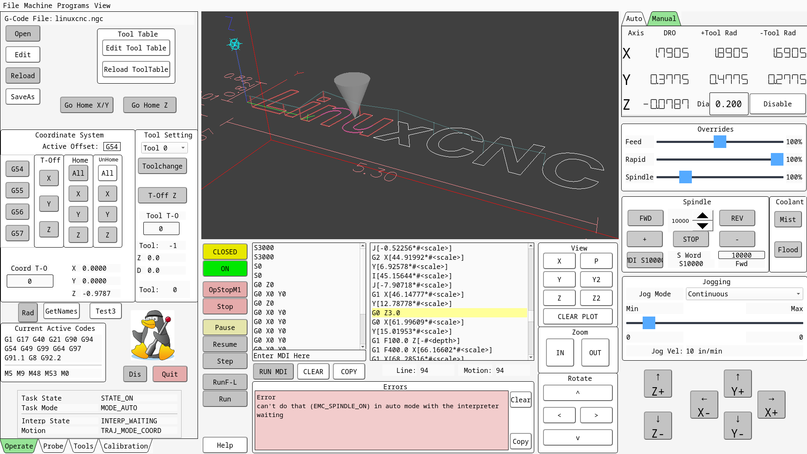
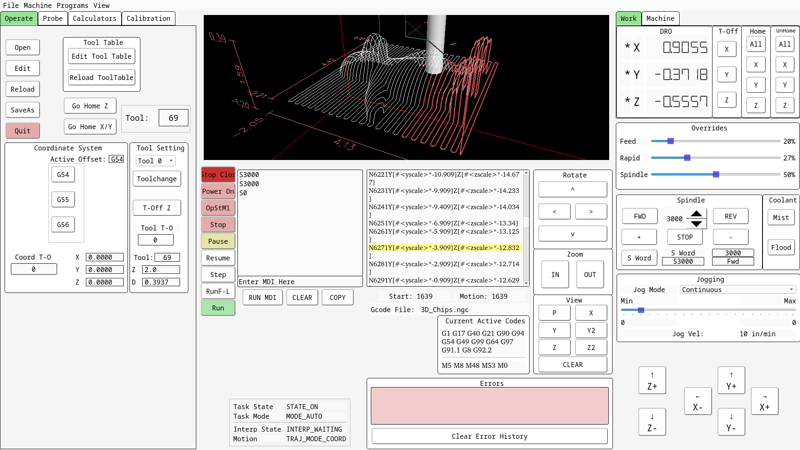

### NOTE 
This is old and stale, because it was uploaded from a Raspberry Pi 4B, which has since been updated to a Rpi5 (which does work much better.)  But since it is a different computer, there is no way to re-link it as the original and continue updating this.  It will all be redone sometime soon.

### About
This is the ~/linuxcnc folder on a Raspberry Pi 4B + Mesa 7C80 + Flex GUI + Waveshare 22930 touchscreen + VistaCNC P2S pendant:
* https://store.mesanet.com/index.php?route=product/product&product_id=345
* https://www.gnipsel.com/linuxcnc/flexgui/index.html
* https://www.waveshare.com/product/raspberry-pi/displays/lcd-oled/15.6hp-capqled.htm?___SID=U
* https://vistacnc.com/b08_pendant_P2/pendant_p2-S.htm

These files are changing often and incomplete as my machine is *still* being built over years.  You may look, but definitely do not blindly copy to your machine as it will not work.  Each LinuxCNC install is unique; this one moreso than others.

This config is based off of a HostMot2 example on the LinuxCNC code base: https://github.com/LinuxCNC/linuxcnc/tree/master/configs/by_interface/mesa/hm2-stepper

NOTE that this config does NOT use P.I.D. loops at all, which makes it nice and snappy on an Rpi4B, but it has not been tested in production and may be found to be totally unsuitable.  PID is required if running any sort of closed-loop control.

### Some possibly outdated examples of this GUI:
2025 added Python script to allow disabling WiFi / Ethernet, and buttons to restart / power-off the machine.

Added DRO +/- tool radius for manual milling.  Uses a python import for the calculations.

Onto Flex4 config... what a long, strange road it's been...
